# 🔍 Advanced Threat Hunt: Unauthorized TOR Browser Detection

<div align="center">


[](https://security.microsoft.com)
[](https://docs.microsoft.com/en-us/azure/data-explorer/kusto/query/)
[](https://attack.mitre.org/)
[](LICENSE)

**🎯 Real-world threat hunting investigation showcasing enterprise security monitoring and incident response capabilities**

</div>

---

## 📋 Executive Summary

This investigation documents the **successful detection and containment** of unauthorized TOR browser usage on corporate workstation `rafi-win`. Through systematic threat hunting, we identified a complete attack chain from installation to active usage, demonstrating advanced EDR capabilities and rapid incident response.

### 🔑 Key Achievements

<table>
<tr>
<td align="center">
<h3>⏱️</h3>
<b>4 Minutes</b><br>
Detection Time
</td>
<td align="center">
<h3>📊</h3>
<b>116 Events</b><br>
Analyzed
</td>
<td align="center">
<h3>🎯</h3>
<b>11 Network IOCs</b><br>
Identified
</td>
<td align="center">
<h3>🛡️</h3>
<b>100%</b><br>
Contained
</td>
</tr>
</table>

---

## 🚨 Threat Scenario

**Context**: Management identified suspicious encrypted traffic patterns and connections to known TOR infrastructure. Anonymous reports indicated employees discussing methods to bypass security controls.

**Mission**: Detect, analyze, and remediate any TOR usage across the enterprise to maintain security compliance and prevent data exfiltration.

---

## 🏗️ Technical Architecture

<div align="center">


</div>

### Environment Stack
- **Platform**: Microsoft Defender for Endpoint
- **Query Language**: Kusto Query Language (KQL)
- **Data Sources**: DeviceFileEvents, DeviceProcessEvents, DeviceNetworkEvents
- **Target OS**: Windows 10 Enterprise

---

## 🔬 Investigation Methodology

### Detection Strategy

```mermaid
graph LR
    A[🔍 Threat Intel] --> B[📁 File Analysis]
    B --> C[⚙️ Process Tracking]
    C --> D[🌐 Network Analysis]
    D --> E[📊 Timeline Build]
    E --> F[🚨 Response]
```



---

## 📊 Investigation Findings

### 📁 Phase 1: File System Analysis

<details>
<summary><b>Click to expand detection query and findings</b></summary>

```kql
// TOR File Detection - Comprehensive Analysis
DeviceFileEvents
| where DeviceName == "rafi-win"
| where InitiatingProcessAccountName == "rafi03"
| where FileName contains "tor" or FolderPath contains "Tor Browser"
| where Timestamp >= datetime(2025-07-26T05:58:42.8355435Z)
| extend 
    RiskScore = case(
        FileName endswith ".exe" and ActionType == "FileCreated", 10,
        FileName contains "tor-browser", 8,
        ActionType == "FileRenamed", 5,
        3
    )
| project Timestamp, ActionType, FileName, FolderPath, SHA256, RiskScore
| order by RiskScore desc, Timestamp asc
```

**Key Discovery**: Detected **102 file events** with TOR installer `tor-browser-windows-x86_64-portable-14.5.5.exe` scoring highest risk (10/10). Multiple TOR components extracted to Desktop location.


</details>

### ⚙️ Phase 2: Installation Detection

<details>
<summary><b>Click to expand detection query and findings</b></summary>

```kql
// TOR Installation Detection - Silent Install Analysis
DeviceProcessEvents
| where DeviceName == "rafi-win"
| where ProcessCommandLine contains "tor-browser-windows-x86_64-portable-14.5.5.exe"
| extend 
    ThreatLevel = case(
        ProcessCommandLine contains "/S", "HIGH - Silent Install",
        ProcessCommandLine contains "/D=", "MEDIUM - Custom Directory",
        "LOW - Interactive Install"
    )
| project Timestamp, AccountName, FileName, ProcessCommandLine, ThreatLevel, SHA256
```

**Critical Finding**: **Silent installation confirmed** with ThreatLevel: "HIGH - Silent Install" using `/S` parameter. Single installation event captured with full command line logging.


</details>

### 🚀 Phase 3: Process Execution

<details>
<summary><b>Click to expand detection query and findings</b></summary>

```kql
// TOR Process Execution - Browser and Service Analysis
DeviceProcessEvents
| where DeviceName == "rafi-win"
| where FileName has_any("tor.exe", "firefox.exe") 
    and FolderPath contains "Tor Browser"
| extend 
    ProcessType = case(
        FileName == "tor.exe", "TOR Service",
        FileName == "firefox.exe", "TOR Browser",
        "Unknown"
    )
| summarize 
    ProcessCount = count(),
    FirstSeen = min(Timestamp),
    LastSeen = max(Timestamp)
    by AccountName, ProcessType, FileName
| order by FirstSeen asc
```

**Confirmation**: **2 distinct process types** identified:
- TOR Browser (firefox.exe): 1 process instance
- TOR Service (tor.exe): 1 process instance
- Total execution timespan: FirstSeen to LastSeen captured


</details>

### 🌐 Phase 4: Network Analysis

<details>
<summary><b>Click to expand detection query and findings</b></summary>

```kql
// TOR Network Detection - Connection Analysis
let TorPorts = dynamic([9001, 9030, 9040, 9050, 9051, 9150]);
DeviceNetworkEvents
| where DeviceName == "rafi-win"
| where RemotePort in (TorPorts) 
    or InitiatingProcessFileName in~ ("tor.exe", "firefox.exe")
| where InitiatingProcessAccountName != "system"
| extend 
    ConnectionType = case(
        RemotePort == 9001, "TOR Relay",
        RemotePort == 9150, "SOCKS Proxy",
        RemoteIP startswith "127.", "Local Proxy",
        "Unknown TOR"
    )
| summarize 
    TotalConnections = count(),
    SuccessfulConnections = countif(ActionType == "ConnectionSuccess"),
    UniqueIPs = dcount(RemoteIP),
    FirstConnection = min(Timestamp)
    by InitiatingProcessFileName, ConnectionType, RemotePort
```

**Network Breach**: **11 distinct network patterns** detected across multiple connection types:
- TOR Relay connections confirmed
- SOCKS Proxy activity identified
- Multiple successful connections established
- Unique IP addresses contacted across different ports (9001, 9150, etc.)


</details>

---

## ⏱️ Attack Timeline

<div align="center">

| Time | Phase | Event | Severity |
|------|-------|-------|----------|
| **11:58:42** | Preparation | TOR installer staged in Downloads | 🟡 Medium |
| **12:00:04** | Installation | Silent installation executed (`/S` flag) | 🟠 High |
| **12:01:01** | Execution | TOR Browser launched | 🔴 Critical |
| **12:01:24** | Network | Connected to TOR relay network | 🔴 Critical |
| **12:01:43** | Activity | Multiple TOR connections attempted | 🟠 High |

</div>

---

## 🎯 Key Indicators of Compromise (IOCs)

### File Indicators (102 Events Detected)
| Type | Value | Risk Score |
|------|-------|------------|
| **Installer** | `tor-browser-windows-x86_64-portable-14.5.5.exe` | 10/10 |
| **SHA256** | `6d38a13c6a5865b373ef1e1ffcd31b3f359abe896571d27fa666ce71c486a40d` | Critical |
| **Location** | `C:\Users\Rafi03\Desktop\Tor Browser\` | High Risk |
| **File Count** | 102 TOR-related files created/modified | Suspicious |

### Process Indicators (2 Process Types)
| Process | Type | Count |
|---------|------|-------|
| firefox.exe | TOR Browser | 1 |
| tor.exe | TOR Service | 1 |

### Network Indicators (11 Connection Patterns)
| Connection Type | Ports Used | Status |
|-----------------|------------|--------|
| TOR Relay | 9001 | Active |
| SOCKS Proxy | 9150 | Active |
| Local Proxy | 127.0.0.1 | Active |
| Multiple IPs | Various | Confirmed |

---

## 🚓 Incident Response

### Immediate Actions Taken

<table>
<tr>
<td>✅ <b>Device Isolated</b><br>Network access terminated</td>
<td>✅ <b>Account Suspended</b><br>User access revoked</td>
<td>✅ <b>Evidence Preserved</b><br>Forensic data captured</td>
<td>✅ <b>Management Notified</b><br>Stakeholders informed</td>
</tr>
</table>

### Recommended Actions

1. **Immediate**
   - Deploy application whitelisting
   - Block TOR infrastructure at firewall
   - Conduct user security training

2. **Long-term**
   - Implement behavioral analytics
   - Enhance network monitoring
   - Regular threat hunting exercises

---

## 💡 Skills Demonstrated

This investigation showcases:

- **🔍 Advanced Threat Hunting** - Multi-source correlation and analysis
- **💻 Technical Expertise** - KQL mastery and EDR platform proficiency  
- **📊 Analytical Thinking** - Pattern recognition and timeline reconstruction
- **📝 Documentation Skills** - Clear, professional reporting
- **🚨 Incident Response** - Rapid containment and remediation

---

## 📁 Repository Structure

```
tor-threat-hunt/
├── 📄 README.md                    # This file
├── 📊 data/                        # Investigation data
│   └── [CSV files]                 # Raw event data
├── 🔍 queries/                     # Detection queries
│   └── [KQL files]                 # Reusable hunting queries
├── 📸 evidence/                    # Investigation artifacts
│   ├── screenshots/                # Visual evidence
│   └── iocs.json                   # Structured IOC data
└── 📚 docs/                        # Supporting documentation
    ├── methodology.md              # Detection methodology
    ├── timeline.md                 # Detailed timeline
    └── playbook.md                 # Response procedures
```

---

## 🛠️ Technologies Used

<div align="center">


</div>

---

## 📫 Connect with Me

<div align="center">

**[LinkedIn](https://www.linkedin.com/in/abdullah-al-rafi03/)** | **[GitHub](https://github.com/rafi03)** | **[Email](mailto:alrafikp@gmail.com)**

*Passionate about cybersecurity and always eager to discuss threat hunting strategies!*

</div>

---

<div align="center">

**🛡️ Protecting Organizations Through Proactive Threat Detection 🛡️**

</div>